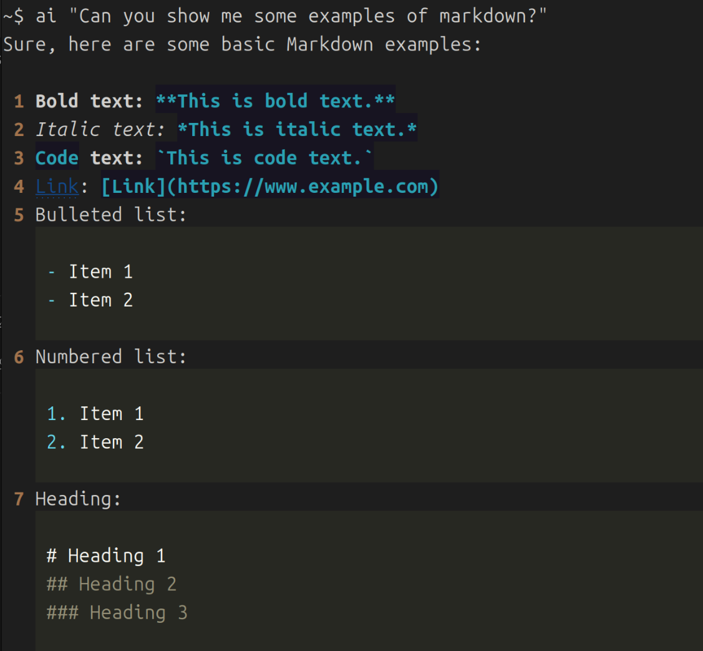
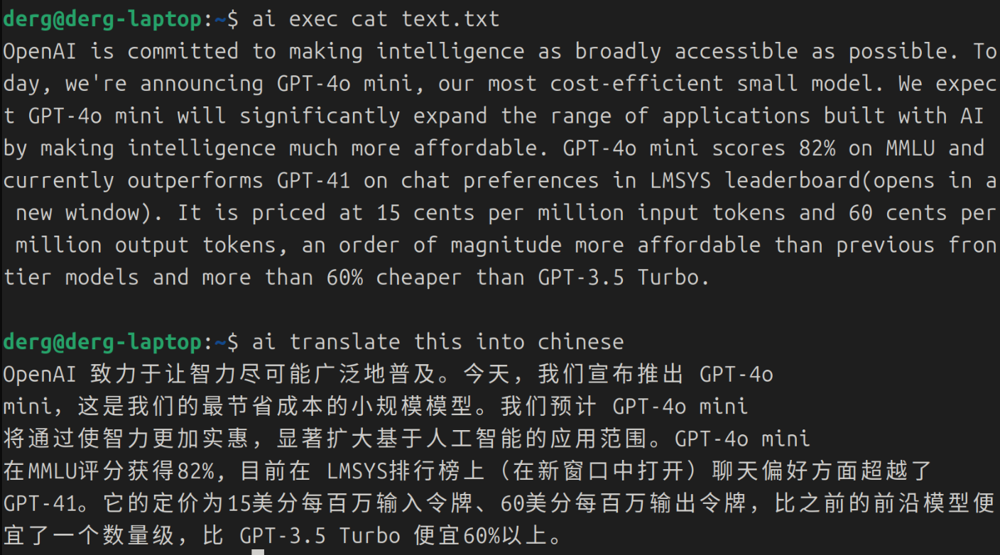

# Shell AI

Chat with AI directly from your shell. This is a simple tool I created for my own use.

## Setup

### Install `rich`

```bash
pip install rich
```

### Copy to System Environment

```bash
sudo cp ai.py /usr/bin/ai
sudo chmod +x /usr/bin/ai
```

### Configure Your API Token

Create or edit the `~/.shell_ai_config` file with your API token and URL:

```json
{
    "api_url": "https://api.openai.com/v1/chat/completions",
    "api_token": "YOUR-TOKEN-HERE"
}
```

## Usage

### In Your Shell

To interact with the AI, simply type:

```bash
ai Can you show me some examples of markdown
```

If your prompt includes special characters, enclose it in quotes:

```bash
ai "Can you show me some examples of markdown?"
```



### Include Shell Command Output
You can add output of a shell command to context.

```bash
ai exec [shell command]
```
For example, you can include a txt file in the context by `ai exec cat text.txt`:



### Reset Context

To reset the AI's context, use the following command:

```bash
ai reset
```
